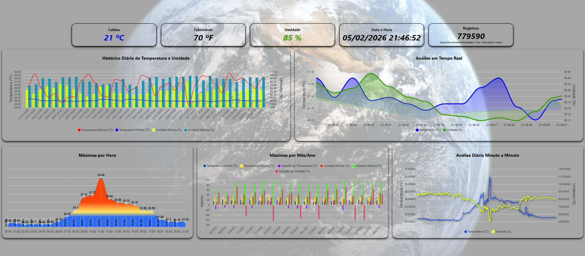

# Plataforma IoT para Coleta e Persistência de Dados Ambientais 

A arquitetura apresentada ilustra um sistema de aquisição, processamento e persistência de dados ambientais baseado em IoT, composto por sensor, microcontrolador, frontend, backend e banco de dados.

O sensor SHT45 é responsável pela medição de temperatura e umidade do ar. Esse sensor está conectado a um ESP32, que realiza a leitura periódica dos dados ambientais, além de manter informações internas como uptime (tempo em operação) e data/hora.

O ESP32 atua como um web server, expondo os dados coletados por meio de um endpoint HTTP no formato JSON. Esse endpoint é acessado via rede sem fio (Wi-Fi).

No backend, desenvolvido em Java, existe um job agendado que é executado a cada 1 minuto. Esse job realiza uma requisição HTTP GET ao ESP32 para obter os dados mais recentes do sensor. Após a recepção, o backend pode aplicar validações, normalizações e regras de negócio — incluindo mecanismos de fallback, caso o ESP32 esteja indisponível ou retorne dados inconsistentes.

Em seguida, os dados processados são enviados ao banco de dados por meio de uma requisição HTTP POST (ou operação equivalente de persistência). As informações armazenadas incluem:

	Temperatura (°C e °F)

	Umidade do ar

	Data e hora da medição

	UUID de identificação

	Uptime do ESP32

	Indicador de fallback

Esse fluxo garante a desacoplagem entre a camada de coleta (ESP32), a camada de processamento (backend Java), a camada de apresentação (frontend React) e a camada de persistência (banco de dados), permitindo maior escalabilidade, tolerância a falhas e facilidade de manutenção do sistema.

## Estrutura do Projeto

- **1. Camada de Sensoriamento (Edge Layer)**

    O sensor SHT45 realiza medições de temperatura e umidade relativa do ar, oferecendo alta precisão e estabilidade térmica. Ele se comunica com o microcontrolador por meio de barramento I²C, com leituras periódicas controladas pelo firmware.
	 
	 O ESP32 atua como dispositivo de borda (edge device) e possui múltiplas responsabilidades:
	 
	 	Aquisição dos dados do sensor

	 	Gerenciamento de uptime

	 	Sincronização de data e hora (tipicamente via NTP)

	 	Disponibilização dos dados via API REST

	 	Operação contínua com suporte a watchdog, prevenindo travamentos e reinicialização

- **2. Exposição dos Dados (Web Server embarcado)**

	O ESP32 implementa um Web Server HTTP, expondo um endpoint do tipo GET, que retorna os dados no formato JSON, contendo:
	
		Temperatura em Celsius e Fahrenheit

		Umidade do ar

		Data e hora da medição

		Tempo de atividade do dispositivo (uptime)
	
	Essa abordagem elimina a necessidade de push contínuo, reduzindo consumo de energia e tráfego de rede, além de facilitar testes e diagnósticos manuais.

- **3. Comunicação em Rede**

	Toda a comunicação ocorre via Wi-Fi, utilizando o protocolo HTTP, o que garante:
	
	- Simplicidade de integração
	
	- Compatibilidade com firewalls e redes locais
	
	- Facilidade de expansão para HTTPS, autenticação por token ou API Key

- **4. Camada de Backend (Processamento Central)**

	O backend Java funciona como o núcleo lógico do sistema. Um job agendado, executado a cada 1 minuto, realiza as seguintes etapas:
	
	Requisição HTTP GET ao ESP32
	
		Desserialização do JSON recebido
	
		Validação dos dados (faixa válida, valores nulos, consistência temporal)
	
		Aplicação de regras de negócio
	
		Mecanismo de Fallback
	
	Caso o ESP32 esteja indisponível ou retorne erro:
	
		O backend registra a falha
	
		Marca o registro com o indicador fallback

		Opcionalmente reutiliza o último valor válido conhecido

	Esse mecanismo garante continuidade histórica dos dados, mesmo em cenários de falha intermitente do dispositivo.

- **5. Persistência de Dados (Data Layer)**

	Após o processamento, o backend realiza a persistência no banco de dados, via POST ou acesso direto ao repositório. Cada registro armazena:

		UUID único para rastreabilidade

		Temperatura (°C e °F)

		Umidade do ar

		Data/hora normalizada

		Uptime do ESP32

		Flag de fallback

	Esse modelo favorece:

	- Auditoria de dados

	- Análises históricas

	- Identificação de falhas de comunicação ou hardware

- **6. Visualização e Monitoramento em Tempo Real (Frontend)**

	Foi incorporada à solução uma camada de frontend dedicada à visualização gráfica dos dados ambientais, ampliando a usabilidade e a capacidade de monitoramento do sistema. 
	
	O frontend consome os dados disponibilizados pelo backend e apresenta gráficos dinâmicos, incluindo visualizações em tempo real, que refletem continuamente as leituras mais recentes de temperatura e umidade coletadas pelos dispositivos IoT.

	Funcionalidades principais do frontend

		Exibição de gráficos históricos, permitindo análise temporal das medições

		Visualização em tempo real, com atualização periódica automática

		Separação clara entre:

			Temperatura (°C) Celsius
			
			Temperatura (°F) Fahrenheit

			Umidade do ar

		Painéis informativos com dados consolidados

		Atualização contínua sem necessidade de recarregamento da página

	Integração com a arquitetura

	O frontend não se comunica diretamente com os dispositivos ESP32. Toda a interação ocorre exclusivamente por meio do backend, o que garante:

	Segurança, evitando exposição direta dos dispositivos

	Desacoplamento, permitindo evolução independente da interface

	Escalabilidade, já que múltiplos usuários podem acessar os gráficos simultaneamente

	Essa abordagem transforma os dados brutos coletados pelo sistema IoT em informação visual compreensível, facilitando a tomada de decisão, o acompanhamento de tendências e a identificação rápida de anomalias ambientais.

	Contribuição para a solução

	A inclusão do frontend eleva a arquitetura de um sistema de coleta passiva para uma plataforma completa de monitoramento, tornando a solução adequada tanto para aplicações acadêmicas quanto para cenários profissionais e industriais.

- **7. Backup Automático e Confiabilidade dos Dados**

	Backup Automático e Confiabilidade dos Dados

	A solução implementa um mecanismo de backup automático diário, garantindo a integridade, disponibilidade e segurança dos dados ambientais armazenados no sistema.

	O banco de dados PostgreSQL, responsável pela persistência das medições, está hospedado em infraestrutura de nuvem utilizando o serviço Railway, que fornece suporte nativo a backups gerenciados.

	Funcionamento do backup

	O backup é executado automaticamente todos os dias à 0h (00:00)

	O processo é totalmente automatizado, não exigindo intervenção manual

	Os dados são armazenados em ambiente de nuvem, independente da aplicação

	O procedimento protege contra:

		Falhas de hardware

		Corrupção de dados

		Erros operacionais

		Exclusões acidentais

- **8. Boas práticas e pontos fortes da arquitetura**

	- Desacoplamento total entre hardware e persistência
	
	- Backend como orquestrador, evitando lógica complexa no ESP32
	
	- Escalável: múltiplos ESP32 podem ser integrados facilmente
	
	- Observabilidade: uptime e fallback ajudam no diagnóstico
	
	- Tolerância a falhas com watchdog e fallback lógico
	
	- Extensível: fácil inclusão de novos sensores ou métricas
	
	- Pronto para dashboards, alertas e integração com sistemas externos

- **9. Tecnologias utilizadas na solução**

	- ESP32 – microcontrolador com conectividade Wi-Fi

	- Sensor SHT45 – sensor digital de temperatura e umidade

	- C/C++ (Arduino Framework) – desenvolvimento do firmware embarcado

	- Wi-Fi – meio de comunicação

	- HTTP – protocolo de comunicação

	- JSON – formato de serialização de dados

	- Java – linguagem do backend

	- Spring Boot – framework para criação do backend

	- Spring Web – APIs REST

	- Spring Scheduling – execução de jobs agendados

	- Spring Data JPA / Hibernate – persistência de dados

	- Banco de Dados Relacional – armazenamento histórico das medições

	- UUID – identificação única dos registros

	- React – desenvolvimento do frontend

	- ApexCharts (React ApexCharts) – visualização gráfica e tempo real

	- Git – controle de versão

	- Railway – infraestrutura em nuvem e gerenciamento de backups

## Possíveis evoluções naturais

- Uso de HTTPS + autenticação
	
- Cache local no ESP32 para o caso de falha

- Envio assíncrono via MQTT

- Alertas automáticos (ex: temperatura fora do limite)

- Monitoramento de saúde do dispositivo (health check)

## Contribuições

1. Faça um fork do projeto.
2. Crie uma nova branch: `git checkout -b minha-nova-feature`.
3. Faça suas alterações e commite elas: `git commit -m 'Adiciona nova feature'`.
4. Envie para o branch original: `git push origin minha-nova-feature`.
5. Crie um pull request.

## Licença

	Este projeto está licenciado sob a Licença MIT.

## Contato

	Para mais informações ou suporte, entre em contato com wagnerdba@gmail.com
